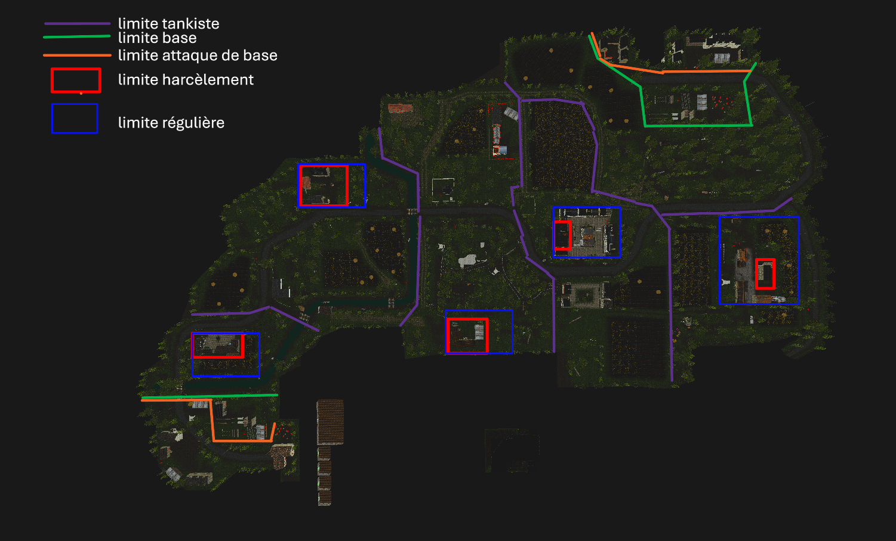

# 📝 Règlement Général

<figure><figcaption></figcaption></figure>

1. Interdiction de <mark style="color:blue;">**TeamKill**</mark> (tuer quelqu'un de votre camp).
2. Interdiction de <mark style="color:blue;">**Freekill**</mark> (tuer quelqu'un sans raisons RP).
3. Interdiction de <mark style="color:blue;">**Bunnyhop**</mark> (sauter en l'air pour être plus rapide ou esquiver les tirs ennemis).
4. Interdiction de <mark style="color:blue;">**Props Block**</mark> (bloquer l'accès à une zone en utilisant un objet).
5. Interdiction de <mark style="color:blue;">**Props Fly**</mark> (Utilisation des objets pour voler...).
6. Interdiction de <mark style="color:blue;">**Props Boost**</mark> (utiliser un props pour atteindre une zone inatteignable).
7. Le <mark style="color:blue;">**PainRP**</mark> doit être respecté et mis en place (ressentir la sensation de douleur).
8. Le <mark style="color:blue;">**FearRP**</mark> doit être respecté et mis en place (ressentir la sensation de peur).
9. Interdiction de faire du <mark style="color:blue;">**HRP Vocal**</mark> (le fait de s'exprimer en dehors du cadre RP).
10. Obligation de respecter le <mark style="color:blue;">**NLR**</mark> (vous devez attendre 4 **minutes** pour repartir au combat).
11. Interdiction de <mark style="color:blue;">**Metagaming**</mark> (prendre les informations de l'interface dans le RP).
12. Interdiction de <mark style="color:blue;">**ForceRP**</mark> (vous ne pouvez pas forcer quelqu'un à entrer dans votre RP)
13. La publicité est strictement interdite sur le serveur.
14. Interdiction de <mark style="color:blue;">**Usebug**</mark> (si un bug se présente à vous, vous devez obligatoirement le signaler à l'équipe administrative, tout exploit de ce bug (selon la gravité) pourra mener à un bannissement de notre serveur).
15. Interdiction de <mark style="color:blue;">**Jump shot**</mark> (Il est interdit de sauter et tirer en même temps)
16. Un passif pour l'équilibrage est possible lorsque le staff en estime la nécessité
17. Toutes les photos ou screens pris IG à des fins rp doivent être pris avec l'appareil photo achetable dans le F4. Pour rendre les infiltrations détectables ou autres.
18. Vous avez interdiction de transmette des informations depuis Discord.
19. Pour effectuer une demande d'unwarn, vous devez le faire maximum 5 jours après avoir pris le warn si vous pensez que celui-ci n'as pas lieu d'être, ne respecte pas la charte, ou est une erreur, sinon il ne pourras plus être retiré.
20. Le phosphore est interdit.
21. Interdiction de faire de la double communication (TS/Discord ect...).
22. Il est interdit d'utiliser la matraque au combat dans le but d'assomer et capturer l'ennemi.
23. Il est formellement interdit de dropper de manière volontaire une arme à quelqu'un de sa faction . La récupération d'arme de prisonnier reste autorisée tant qu'elle est cohérente . tout non respect entrainera un avertissement (warn) immédiat .
24. Tout contournement d'une scène de capture grâce à l'usage d'une pilule de cyanure, grâce à un suicide par balle dans la tête ou autres ; équivaut à un Character Kill immédiat et Roleplay Kill si répété .
25. Une fois que vous vous êtes fait réanimé vous devez respecter une convalescence de 2 minutes minimum.
26. Ce règlement s'applique uniquement si la faction qui a le gradé en otage possède un membre de sa police militaire.

    <figure><figcaption></figcaption></figure>

| Infraction | Durée du bannissement |
| ---------- | --------------------- |
| 3 Warns    | 48 heures             |
| 6 Warns    | Une semaine           |
| 9 Warns    | Deux semaines         |
| 12 Warns   | Permanent             |


* **Vous pouvez vous faire retirer vos avertissements à partir de&#x20;**<mark style="color:red;">**3 mois**</mark>**&#x20;en effectuant une demande sur le discord** [**centre d’aide**](https://discord.gg/jzMRKAGSWG)**.**
* **Votre avertissement se retire&#x20;**<mark style="color:red;">**168 heures de jeu**</mark>**&#x20;sur le serveur après votre avertissement. (uniquement pour les avertissements après le 1er juillet 2023)**

