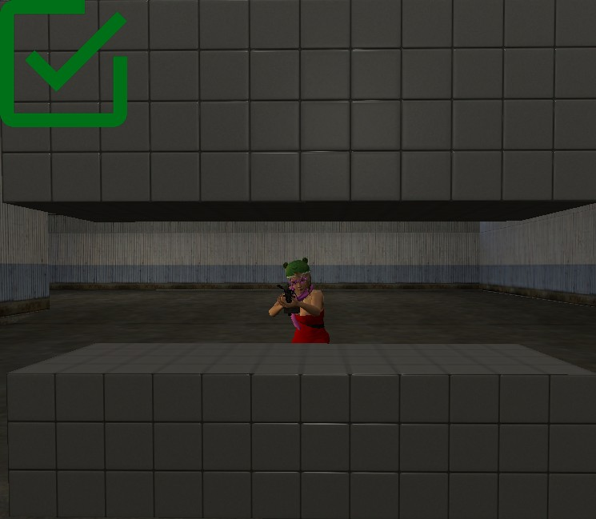
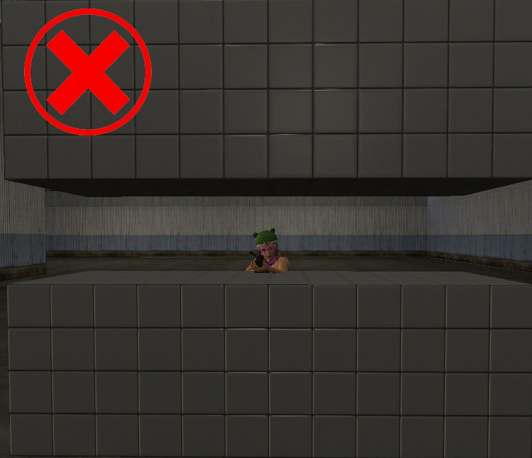

# 📄 Général

## :blue\_book: _<mark style="color:yellow;">**Les Bases**</mark>_ :blue\_book:

<mark style="color:purple;">**01**</mark> - Le **Freekill** : Tuer un joueur sans raison valable, vous devez prendre en compte qu'un meurtre est considéré comme <mark style="color:blue;">**dernière solution**</mark> dans une action.

<mark style="color:purple;">**02**</mark> - Le **Freeshoot** : Tirer sur une personne sans raison <mark style="color:blue;">**valable**</mark>.&#x20;

<mark style="color:purple;">**03**</mark> - Le **Teamkill** : Tirer ou tuer l'un de <mark style="color:blue;">**ses coéquipiers**</mark> ou une personne du <mark style="color:blue;">**même métier que vous**</mark>. (Ils sont autorisés à se tuer mutuellement s'ils engagent une scène entre membres de leur propre faction (ex : cambriolage)). Si vous avez besoin d'abattre un concurrent ou bien un ami faite appelle à un tueur à gages.

<mark style="color:purple;">**04**</mark> - Le **Freepunch** : Taper une personne sans raison <mark style="color:blue;">**valable**</mark>.

<mark style="color:purple;">**05**</mark> - Le **Freetaze** : Tazer une personne sans raison <mark style="color:blue;">**valable**</mark>.

<mark style="color:purple;">**06**</mark> - Le **FairPlay** : <mark style="color:blue;">**Respecter les règles du jeu,**</mark> <mark style="color:blue;">**ne pas ce donner tous les avantages et donner une chance au plus petit de pouvoir s'en sortir**</mark>. Le but d'une action n'est pas de se finir en quelques minutes, mais bien d'allonger celle-ci afin de prendre plus de plaisir et que votre Rp vous soit satisfait à la fin de chaque action.

<mark style="color:purple;">**07**</mark> - Le **Propskill** : Tuer une personne avec un props est <mark style="color:red;">**interdit**</mark>.

<mark style="color:purple;">**08**</mark> - Le **Propsclimb** : C'est le fait d'utiliser des <mark style="color:red;">**props pour monter à des endroits inaccessibles**</mark> normalement.

<mark style="color:purple;">**09**</mark> - Le **Propsblock** : C'est le fait d'utiliser des props pour <mark style="color:red;">**bloquer un accès existant**</mark> ou bien <mark style="color:red;">**une zone**</mark> <mark style="color:red;">**sans mettre de keypad ou un bouton.**</mark>

<mark style="color:purple;">**10**</mark> - Le **Powergaming** : C'est le fait de faire <mark style="color:blue;">**une action qui n'est pas réalisable**</mark> en temps normale (_ex : S'asseoir pour éviter les balles, sauter d'une falaise en voiture_)

<mark style="color:purple;">**11**</mark> - Le **MassRP** : C'est le fait de simuler la présence d'habitants et de civils partout en ville. Celle-ci n'est pas remplie **seulement de joueurs mais bien de milliers de citoyens.** (Le MassRP s'applique partout en ville, celle-ci est indiquée par des panneaux "LBRP City". Bien sûr, une action comme, par exemple, le **braquage de banque** est toujours possible.) Une personne en dehors de la zone de MassRP n'a pas le droit d'interagir avec une scène qui se passe dans la zone de MassRP. Si vous vous faites attaquer par des personnes autres que les forces de l'ordre, vous avez le droit de sortir votre arme pour vous défendre. Vous pouvez sortir vos armes pour une **action comme un braquage** **de banque**, une **prise d'otage** (**banque**), ou une **prise d'otage** (**en tant que dictateur**). À part ces deux situations, vous ne pouvez pas sortir votre arme pour une quelconque action RP. Les petites rues, par exemple, derrière la banque, derrière le concessionnaire, et derrière l'hôpital, sont comprises dans la zone du MassRP. Vous ne pouvez pas sortir votre arme pour effectuer une action RP.

<mark style="color:purple;">**12**</mark> - Le **Travers** : C'est le fait de tirer à travers une surface opaque telle que des murs, des props, des smokes, etc.. Il est cependant autorisé de tirer à travers les surfaces transparentes. Si un joueur pose un textscreen sur une surface transparente indiquant qu'elle est blindé, il est interdit de tirer à travers. De plus, <mark style="color:red;">**il est interdit de tirer à travers les vitres de la Banque et de l'ascenseur.**</mark>  (textscreen de mis que tu peut pas tiré a travers le props)

<mark style="color:purple;">**13**</mark> - Le **NLR ( New Life Rule )** : C'est le fait de revenir sur une même position/action alors que vous êtes mort durant celle-ci. Ainsi que de vous souvenir de tout ce qu’il s’est passé avant votre mort <mark style="color:blue;">**(Vous pourrez revenir sur le lieu au bout d'une quinzaine de minutes)**</mark>

<mark style="color:purple;">**14**</mark> - Le **Freedemote** : C'est le fait de démote (retirer le grade d’une personne) sans raison rp <mark style="color:blue;">**valable**</mark>.

<mark style="color:purple;">**15**</mark> - Le **Revenge Kill** : C'est le fait de tuer une personne qui vous a tué auparavant.

<mark style="color:purple;">**16**</mark> - Le **Trashtalk** : C'est le fait d'<mark style="color:blue;">**insulter ou de provoquer**</mark> quelqu'un après l'avoir tué (cela fonctionne aussi pour le chat).

<mark style="color:purple;">**17**</mark> - Le **Fear RP** : C'est le fait de <mark style="color:blue;">**simuler la peur**</mark> (_ex : Vous ne pouvez pas sortir d'arme quand vous êtes braqué_). Le FearRP consiste à simuler la peur. Exemple de situation : un policier avec un taser face à une arme à feu -> Le policier doit jouer son FearRP et ranger son taser. Cependant, si quatre policiers avec des tasers font face à une personne armée, ils peuvent tenter une arrestation avec un taser. La logique de supériorité numérique doit être prise en compte.

<mark style="color:purple;">**18**</mark> - Le **Pain RP** : C'est le fait de <mark style="color:blue;">**ressentir la douleur**</mark> infligé par une chute, après avoir reçu des balles, etc. Si vous êtes en incapacité physique de combattre (-15hp) vous ne pouvez donc pas engager / continuer un combat.

<mark style="color:purple;">**19**</mark> - Le **Metagaming** : C'est le fait de connaître des informations HRP sans les connaître dans un contexte RP (_ex : lire le nom d’une personne au-dessus de sa tête, entendre des bruits de printers pour faire un assaut /_ vol / etc ...)

<mark style="color:purple;">**20**</mark> - Le **soundboard** : C'est le fait d'<mark style="color:blue;">**utiliser des sons externes au serveur**</mark> (_ex : des musiques non incluses dans la boombox ou bien la radio dans les véhicules_)

<mark style="color:purple;">**21**</mark> - Le **HRP vocal (Hors RP**) : C'est le fait de <mark style="color:blue;">**parler d’information qui ne concerne en rien dans le Rp**</mark> (_ex : je vais faire un ticket contre toi, tu vas être ban …_)

<mark style="color:purple;">**22**</mark> - Le **WIN RP** : C'est le fait de se <mark style="color:blue;">**donner des avantages dans une action Rp**</mark> (_ex : tirer depuis un buisson, etc ..._ )

<mark style="color:purple;">**23**</mark> - Le **ForceRP** : C'est le fait de <mark style="color:blue;">**provoquer et forcer une action à se faire**</mark>  (_ex : insulter la police pour faire une course-poursuite puis une fusillade_)

<mark style="color:purple;">**24**</mark> - Le **Spawnkill** : C'est le fait de <mark style="color:blue;">**tuer des personnes au spawn ou venant d’y sortir**</mark>

<mark style="color:purple;">**25**</mark>**&#x20;**<mark style="color:blue;">**-**</mark> Le **BunnyHop** est interdit : C'est le fait <mark style="color:blue;">**de ce déplacer en saut de manière continue afin de prendre de la vitesse ou d'esquiver les tires.**</mark>

<mark style="color:purple;">**26**</mark> - **Il est interdit de changer de métier lorsqu’une caisse spawn sur la map. Si cela permet de vous avantager afin de récupérer celle-ci...**

<mark style="color:purple;">**27**</mark>**&#x20;- Le double compte est strictement interdit.**

<mark style="color:purple;">**28**</mark>**&#x20;-** Il est **interdit de gérer les printers et bitminers** qui ne sont pas les sien&#x73;**. Seul le banquier** peut s'occuper de cette tache !

<mark style="color:purple;">**29**</mark>**&#x20;-** Le **Usebug :** C'est le fait d'utiliser une faille d'un système pour en profiter (ex : trouver une commande qui permet de ce give / Empiler les printers de gang les uns sur les autres ... )

\
:french\_bread: <mark style="color:yellow;">Règles Inclus sur le serveur</mark> :french\_bread:
-----------------------------------------------------------------------------------------------

<mark style="color:red;">**Il est formellement interdit de vendre ou de trade des armes permanentes à des prix qui ne respectent pas ceux du !vente In-Game ou dans la catégorie Communauté>Unbox sur le site.**</mark>

#### 🚗 Conduite & Véhicules

Lorsqu'un véhicule blindé ou non blindé est à l'arrêt ou à une vitesse faible (moins de 25 km/h), vous êtes obligé de jouer votre FearRP.

Attention, lorsque vous achetez des voitures dans l'unbox, vous ne pouvez pas les accumuler dans le concessionnaire.

Vous avez obligation d'avoir une conduite RP sur le serveur. (Exemple : Utiliser le nitro pour pit un véhicule perso -> interdit)

#### ⚔️ Combat & Actions RP

Privilégiez toujours le dialogue avant le combat. Pour engager un combat, 3 sommations orales claires et distinctes ou écrites (/ano 3 fois) sont nécessaires avant de tuer une personne armée. Pas de tirs sans sommations, les boosts et grappins ne sont pas des armes.

Lors des affrontements à courte portée (dans le même batiment), il est interdit de changer d'arme (sauf arme légère). Vous ne pouvez utiliser de sniper que sur de la longue distance.&#x20;

Il est interdit de faire des sommations pour une autre personne (pour les personnes menottées ou braquées).

Lorsqu'un joueur lève les mains en l'air, cela signifie qu'il se rend : vous devez l'arrêter ou le prendre en otage, mais vous ne pouvez plus le tuer.

Pour le taser, vous n'avez pas besoin de faire de sommations. Attention à votre FearRP, car un taser ne fait pas le poids face à une ou plusieurs armes à feu.

Vous n'avez pas le droit de vous redonner du kevlar ou de la vie (de quelconque manière) durant une action RP.

Vous ne pouvez en aucun cas vous procurer des objets ou des armes pendant une action RP.

Vous n'avez pas le droit de construire durant une action.

Il est impossible de participer ou d'influencer une action qui a déjà commencé avant votre connexion ou votre changement de métier.

Interdiction de faire des activités illégales dans des endroits inaccessibles ou accessibles uniquement avec un grappin.

#### 🚔 Règles Police

La police doit effectuer une course-poursuite d'au moins 5 minutes avant de pouvoir ouvrir le feu en cas de délit de fuite, sauf si les fuyards ouvrent le feu en premier, auquel cas vous pouvez directement riposter.

Le personnage de policier et le personnage de famille sont totalement distincts : il est interdit de transférer des informations obtenues en tant que policier pour les réutiliser en famille.

#### 💰 Économie & Transactions

Les printers, les racks et les bitminers sont illégaux ; le maire ne peut pas les légaliser.

Les règlements de plus de 10 000 000 € avec le terminal de paiement sont interdits.

Il est impossible de vendre ou d'échanger de l'argent IG contre des avantages boutique (upoints, pack, etc.).

Vous pouvez échanger vos armes contre d'autres armes permanentes en faisant l'équivalent en upoints (les arnaques sont interdites et passibles d'un ban permanent).

Il est interdit de braquer un vendeur d'armes pour éviter de payer.

Il est interdit de braquer ou de tuer un cuisinier.

Les licences d'armes autorisent uniquement les armes de poing, mais interdisent de les utiliser sans raison valable.

#### 👥 Jobs & Alliances

Il y a une limitation de slots par job. Les alliances entre jobs sont interdites, tout comme le recours à des mercenaires ou à d'autres jobs illégaux (sauf productions).

Quand vous mourez ou changez de job, vous oubliez tout ce qu'il s'est passé avant.

#### 🤜 Braquage & Contre-braquage

Vous pouvez faire un contre-braquage uniquement dans le but de sauver un ami d'un racket ou d'un cambriolage (attention à respecter votre FearRP). Vous ne pouvez pas faire de contre-braquage lors d'une prise d'otage, d'un braquage de banque ou d'un braquage de supérette (sauf dans le cadre d'une guerre de famille).

#### 💊 Drogues

Vous ne pouvez pas utiliser de drogues dans le but d'obtenir un avantage pendant une action ou un combat. Mais aussi pour récupérerune lootbox sur la map

#### 🛠️ Outils & Mécaniques

Le /me assomme quelqu'un ne fonctionne pas : un outil spécial est prévu à cet effet. Lorsque vous vous faites assommer, vous oubliez tout ce qu'il s'est passé pendant 5 minutes, après quoi vous vous souvenez de toute la scène.

#### 🔒 Comportement & Règles Générales

Les propos racistes, xénophobes, homophobes ou tout autre propos haineux sont strictement interdits.

Les insultes parentales, familiales ou à titre de dénigrement d'un genre sont formellement interdites.

Le RP sex est strictement interdit et passible de ban.

Il est interdit d'avoir un jeu de mots avec son nom RP, ainsi que d'utiliser le nom d'une personnalité publique.

Il est obligatoire d'avoir un micro pour jouer sur le serveur.

Les publicités sont interdites sur le serveur.

Il est interdit d'utiliser des logiciels ou des bugs fournissant un avantage sur d'autres joueurs (triche, UseBug, etc ...).

Il est interdit de contourner le bannissement d'un compte.

Il est interdit de divulguer tout type d'informations privées sur d'autres joueurs (nom réel, lieu, photo, etc.).

## &#x20;🏗️ <mark style="color:yellow;">Règles de construction</mark> 🏗️

Les constructions avec un sens RP sont obligatoires.

Si vous souhaitez construire votre maison sans être braqué, vous devez placer un textscreen au-dessus de la porte indiquant que vous êtes "en construction". Durant cette période, vous n'avez pas le droit de farmer (printers / bitminers / drogue / etc ...).

Il est interdit de mettre des matériaux sur les entités (printers, bitminers, farm, etc.).

Il est interdit de faire des constructions en forme de labyrinthe.

Votre construction doit être suffisamment large pour permettre à 2 personnes de se tenir côte à côte.

Il est interdit de construire de longs couloirs avec trois SAS alignés et consécutifs (couloir de la mort).

Il est interdit d'intégrer des couleurs (outil couleur, et non matériaux) à vos props lors de constructions en solo destinées à être importées sur le serveur via Advanced Duplicator 2.

#### 🚪 Portes & Accès

Toute entrée (porte, garage, etc.) effectuée par un mappeur doit être accessible au public ou susceptible d'être ouverte avec un lockpick, un keypad ou un bouton. Elle doit être accessible des deux côtés (entrée/sortie). Les balcons doivent comporter une entrée.

Il est interdit de créer des sols, des échelles, des ascenseurs et des plateformes disparaissantes via fading door.

Il est interdit de faire des constructions avec seulement un petit espace pour entrer accroupi.

#### ⚙️ Fading Doors & Keypads

Les fading doors ne peuvent pas être de la même couleur une fois ouvertes (exemple : bleu fermé → bleu ouvert, interdit).

Il est interdit de mettre plus de 2 keypads pour une seule fading door.

Votre bouton/keypad doit obligatoirement être placé dans la même pièce et à proximité de la fading door. Il ne peut pas être caché. Il doit cependant être protégé d'un mur/palissade afin que la personne crackant le keypad ne puisse pas être atteinte.

Il est interdit de mettre un matériau sur un keypad ou un bouton.

Le UseButton en action RP est interdit.

#### 🏠 SAS, Hauteur & Défense

Le nombre maximum de SAS dans une construction est de 3, tous membres confondus.

Il est interdit de construire des bases plus hautes que les bâtiments environnants.

Les meurtrières sont interdites : il s'agit de toute construction ne laissant qu'un petit passage ou écart entre props ou véhicules pour tirer. Pour ne pas être considéré comme une meurtrière, il faut pouvoir passer accroupi et que plus de la moitié du corps soit visible.

#### 🏢 Bâtiments Spécifiques

Il est interdit de privatiser un ou plusieurs étages dans les HLM (Taco Bell/mairie) : votre construction doit commencer à partir de la porte d'entrée.

Règle Discothèque : votre construction doit commencer à partir de l'entrée du bâtiment et se terminer à la fin des escaliers. Toutes les constructions au sous-sol doivent être uniquement décoratives ou dédiées à un métier de production (ex : étagère pour pots de plantation). Elles ne peuvent en aucun cas être défensives ou offensives.

<figure><figcaption></figcaption></figure> <figure><figcaption></figcaption></figure>

### Application du bannissement en cas d'infractions

| Infraction | Durée du banissement |
| ---------- | -------------------- |
| 5 warns    | 3 jours              |
| 10 warns   | 6 jours              |
| 15 warns   | 2 semaines           |
| 20 warns   | Permanent            |

Un warn peut vous être retiré par un membre du staff seulement s'il date de <mark style="color:blue;">**2 mois**</mark> minimum.

Il est impossible de se faire retirer un warn inactif <mark style="color:blue;">**(2 mois)**</mark> si vous êtes <mark style="color:red;">**banni du serveur**</mark>

## Charte sanction joueur

