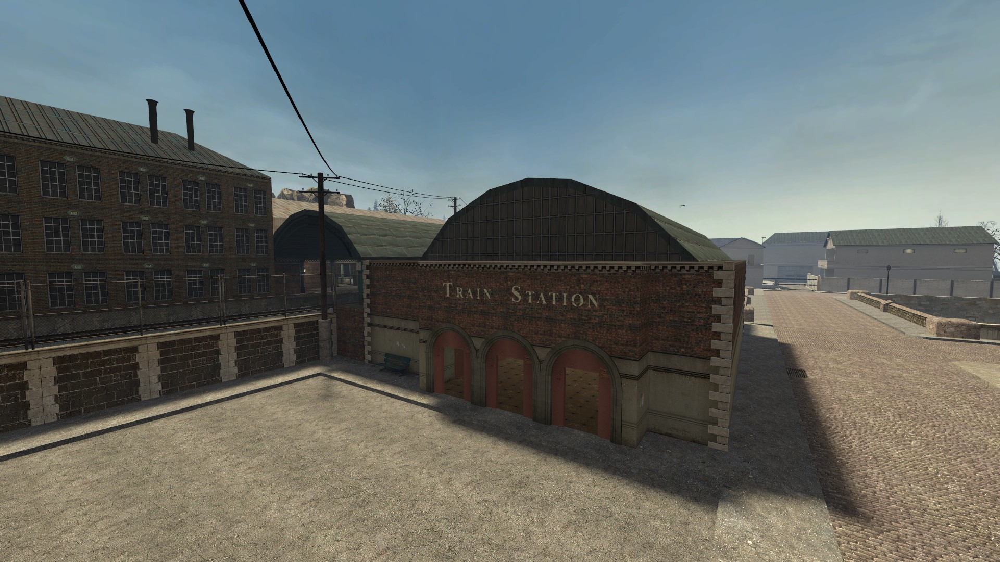

# LBRP - La nuit des longs couteaux

Nom de l'opération: La nuit des longs couteaux\
Document rédigée par : Ludwig Schmit\
Organisateurs prévus : Ludwig Schmit\
Durée : 1H30 - 2H30\
Caractéristique : Aucune

### <mark style="color:purple;">Addon requis</mark> :

* Map de l'événement : [https://steamcommunity.com/sharedfiles/filedetails/?id=1188428055 ](https://steamcommunity.com/sharedfiles/filedetails/?id=1188428055)
* PM SA : [ https://steamcommunity.com/sharedfiles/filedetails/?id=2824582155](https://steamcommunity.com/sharedfiles/filedetails/?id=2824582155)

### <mark style="color:purple;">Intitulé</mark> :&#x20;

\[ Histoire de L'évent ] : Berlin 1934 après la montée en puissance d'Adolf Hitler, il est confronté à plusieurs tensions croissantes qui opposent les cercles conservateurs. Hitler a commencé à se lasser du SA est leur chef Ernst Röhm était devenu trop gênant pour Hitler. Heinrich Himmler et Herman Göring n'aimèrent pas Ernst Röhm et en profitèrent pour inventer de fausses rumeurs concernant Ernst. Hitler tombera dans le panneau et ordonnera l’exécution des membres d’état major et des membres de la SA.

<figure><figcaption>
Map RP_BERLIN
</figcaption></figure>

### <mark style="color:purple;">Les Spawns</mark> :&#x20;

#### Spawn SA et SS

<figure><figcaption></figcaption></figure>

#### Spawn Civil

<figure><figcaption></figcaption></figure>

### <mark style="color:purple;">Organisation</mark> :&#x20;

<mark style="color:green;">**1er déroulement**</mark> | Tout ce passe très bien la SA et la SS travail comme à leur habitude avec quelle que tension ils vont veiller à ce que personne s'oppose à leur dirigeant est au parti.

<mark style="color:green;">**2eme déroulement**</mark> | Après une réunion l'ordre sera donner à la SS de traquer et de tuer chaque membre de la SA que ce soit homme du rang ou état major les membre de la SA pourront résister face à la SS ou bien de fuir la ville.

### Job <mark style="color:green;">autorisé</mark> et <mark style="color:red;">non autorisé</mark> :&#x20;

* <mark style="color:green;">17e SS</mark>
* <mark style="color:green;">Civil</mark>
* <mark style="color:red;">3E3</mark>
* <mark style="color:red;">HEER</mark>
* <mark style="color:red;">Feldgendarme</mark>
* <mark style="color:red;">29th</mark>
* <mark style="color:red;">Spécialisation US/ALL</mark>
* <mark style="color:red;">9e SS</mark>
* <mark style="color:red;">2nd armored</mark>
* <mark style="color:red;">101st</mark>
* <mark style="color:red;">Sanitats/Medics</mark>
