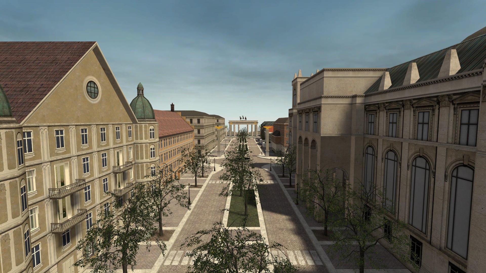
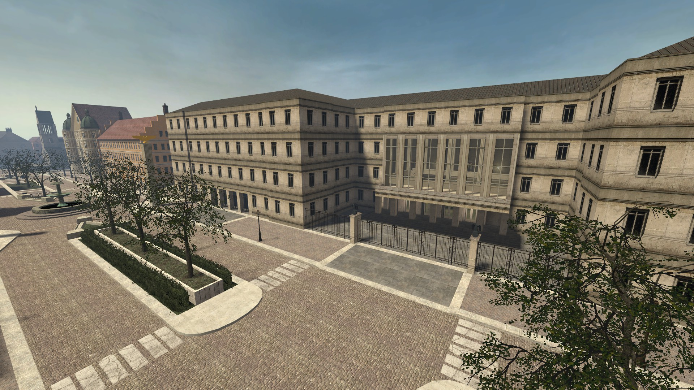
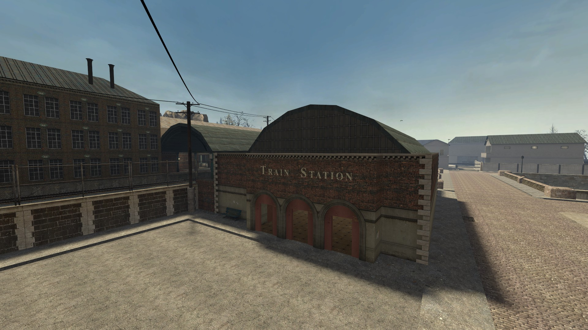

# LBRP - The world in blood

Nom de l'opération: The world in blood\
Document rédigée par : Arnold Horfman\
Organisateurs prévus : Arnold Horfman\
Durée : 2H - 3H\
Caractéristique : Aucune

### <mark style="color:purple;">Addon requis</mark> :

* Map de l'événement : [https://steamcommunity.com/profiles/76561199258756420/myworkshopfiles/?appid=4000\&browsefilter=mysubscriptions\&p=15](https://steamcommunity.com/profiles/76561199258756420/myworkshopfiles/?appid=4000\&browsefilter=mysubscriptions\&p=15)

### <mark style="color:purple;">Intitulé</mark> :&#x20;

\[ Histoire de L'évent ] : Berlin 1945, une étrange maladie s'installe dans la ville du Reich. Créant la peur dans les yeux des civils et des soldats. Un détachement de la 343 arrive dans la ville pour soutenir. La Sanität, la Heer, et la feldgendarmerie établissent une stratégie pour stopper la maladie.

<figure><figcaption>
Map RP_BERLIN
</figcaption></figure>

### <mark style="color:purple;">Les Spawns</mark> :&#x20;

#### Spawn ALL

<figure><figcaption></figcaption></figure>

#### Spawn Civil

<figure><figcaption></figcaption></figure>

### <mark style="color:purple;">Organisation</mark> :&#x20;

<mark style="color:green;">**1er déroulement**</mark> | La maladie est une simple grippe mais très contagieuse. Les Sanitats sont présents pour aider la population. La heer et la feld sont présents pour aider et surveiller.

<mark style="color:green;">**2eme déroulement**</mark> | La maladie est devenue plus dangereuse. Les malades s'agglutinent dans les tentes médicales. Les Sanitats sont débordés et la heer et la feld sont obligés d’utiliser la force pour contrôler la situation. Les infectés sont transportés dans une prison contrôlée par la 17e SS.

<mark style="color:green;">**3eme déroulement**</mark> | Les Sanitats sont inutiles, les malades deviennent de plus en plus agressifs. La feld, la heer et 17e SS sont dans l’obligation d’utiliser leurs armes pour stopper les infectés.

### Job <mark style="color:green;">autorisé</mark> et <mark style="color:red;">non autorisé</mark> :&#x20;

* <mark style="color:green;">ALL343</mark>
* <mark style="color:green;">Feld</mark>
* <mark style="color:green;">Sanitats</mark>
* <mark style="color:green;">17e SS</mark>
* <mark style="color:green;">Civil</mark>
* <mark style="color:red;">Job US ARMY</mark>
* <mark style="color:red;">PZ</mark>
